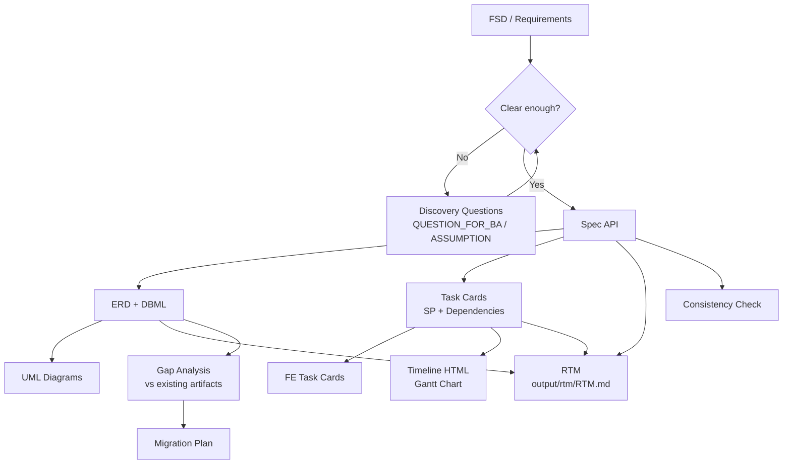

# FSD Analyzer

Transform **Functional Specification Documents (FSD)** into **Markdown-first** technical artifacts — API specs, ERD schemas, UML diagrams, developer task cards, HTML Gantt timeline charts, and a Requirement Traceability Matrix — using AI-powered coding assistants like Cursor, Claude Code, OpenCode, or any agent that supports custom skills.

## What It Does

FSD Analyzer is a **skill/plugin** for AI coding assistants that acts as a Senior System Analyst. It reads your FSD or business requirements and produces:

| Output | Purpose |
|--------|---------|
| **spec_api.md** | REST API contract (endpoints, auth, validation, errors, examples) |
| **erd.md** + **DBML** | Database schema + paste-ready for [dbdiagram.io](https://dbdiagram.io) |
| **UML diagrams** | PlantUML — sequence, class, activity, state, component, use case diagrams |
| **task.md** | Developer task cards with Story Points, dependencies, critical path (copy to Monday, Jira, Confluence) |
| **task_fe.md** | Frontend task cards (component breakdown, API integration, UI states, acceptance criteria) |
| **timeline.html** | Self-contained HTML Gantt chart with Story Points, dependencies, critical path, developer utilization |
| **RTM** | Requirement Traceability Matrix — business requirements → FR → design solution → test case (`output/rtm/RTM.md` / `RTM_<scope>.md`) |
| **openapi.yaml** | OpenAPI 3.0 consolidating all endpoint specs with `x-status` / `x-phase` (`output/spec/openapi.yaml`) |
| **Gap Report** | Structured diff: FSD vs existing ERD/API + migration plan |
| **Consistency Report** | Cross-check: ERD ↔ API spec ↔ tasks |
| **Discovery Questions** | Structured QUESTION_FOR_BA, ASSUMPTION, CONFLICT list for ambiguous FSDs |
| **Auth & Security Spec** | Auth patterns, role-permission matrix, security requirements |
| **Migration Plan** | Zero-downtime migration strategy, rollback plan, deployment sequence |

## Features

- **Generate artifacts** — From FSD to full API spec, ERD, UML diagrams, and task cards
- **UML diagrams** — PlantUML code blocks for [PlantUML](https://plantuml.com) / [PlantText](https://www.planttext.com/): sequence, class, activity, state, component, and use case diagrams
- **Gap analysis** — Compare new FSD against existing database schema and API specs
- **Consistency checks** — Validate alignment across ERD, API spec, and task cards
- **Timeline estimation** — Story Points (1 SP = 4 hours), developer assignment, dependency tracking, critical path analysis, HTML Gantt chart visualization
- **RTM generation** — Trace every business requirement to its design solution and test case. One scope = one BRD/FSD; a BRD/FSD split into multiple feature FDs (`<scope>_fd_<feature>.md`) is traced into a single `output/rtm/RTM_<scope>.md`; uncovered requirements stay as empty cells the dashboard highlights
- **OpenAPI generation** — Consolidate `MASTER_SPEC_API.md` + `output/spec/*.md` into one `output/spec/openapi.yaml` with `x-status`/`x-phase`
- **Discovery mode** — Structured questions for ambiguous FSDs before generating specs
- **Auth & security** — JWT patterns, role-permission matrix, brute force protection, data protection
- **Error catalog** — Standardized error envelope, error codes, HTTP status mapping
- **Frontend tasks** — FE-specific cards with component breakdown, API integration, UI states
- **Migration planning** — Zero-downtime strategy, rollback plan, deployment sequence
- **Master files** — Rolling `MASTER_ERD.md` and `MASTER_SPEC_API.md` for incremental FSD-by-section work
- **Project context** — Template for tech stack, conventions, environments
- **Copy-paste friendly** — Markdown tables, fenced `sql`/`json`/`plantuml` blocks ready for spreadsheets, Jira, Monday, dbdiagram.io, or PlantUML renderers
- **Optional Python scripts** — Validate DBML, check spec structure, extract entity hints, compare artifacts (no external dependencies)
- **Optional Streamlit UI** — Browser-based interface for the validation scripts

## Quick Start

### 1. Use with Cursor / Claude Code / OpenCode

Point your AI assistant to this repo as a skill. For example in **OpenCode**, add to your project's `.agents/skills/` directory or reference the `SKILL.md` directly.

### 2. Create project context (recommended, one-time)

Copy `references/project_context_template.md` to your project root as `project_context.md` and fill in your project details (tech stack, naming conventions, environments, auth patterns).

### 3. In your chat, @-reference your FSD and existing artifacts

```
@project_context.md @fsd_user_management.md — generate spec_api, erd, and tasks
```

---

## Usage Examples

### Discovery / Discussion Mode

When the FSD is still ambiguous or incomplete:

```
FSD ini masih draft. List semua pertanyaan dan asumsi — jangan buat spec dulu.
@fsd_draft.md
```

### Generate Artifacts from FSD

```
Analisis FSD ini dan generate ERD, API spec, task cards
@fsd_user_management.md
```

### Generate UML Diagrams Only

```
Generate PlantUML sequence and class diagrams from this FSD. Only UML, no spec.
@fsd_user_management.md
```

### Document Auth & Security

```
Dokumentasikan auth flow dan role matrix dari FSD ini
@fsd_user_management.md
```

### Frontend Task Cards

```
Generate frontend task cards from this FSD. Include component breakdown, API integration, and acceptance criteria.
@fsd_user_management.md
```

### Gap Analysis

```
Compare this new FSD with our existing ERD and API spec. Produce a Gap Report.
@fsd_new_feature.md @erd_current.md @spec_api_current.md
```

### Consistency Check

```
Check consistency between the ERD, API spec, and task cards. List errors and warnings.
@erd.md @spec_api.md @task.md
```

### Development Timeline with Gantt Chart

Assign tasks to developers and generate a visual timeline:

```
Generate development timeline with Gantt chart from these task cards.
Team: Andi (Senior), Budi (Mid), Citra (Junior)
@task_user_management.md
```

Or directly from FSD:

```
Analisis FSD ini, generate task cards dengan story points, lalu buat timeline HTML dengan Gantt chart.
Assign: Andi (Senior), Budi (Mid), Citra (Junior)
@fsd_user_management.md
```

This generates:
- Task cards with **Story Points** (1 SP = 4 hours)
- **Dependency tracking** (Depends On / Blocks)
- **Critical path** identification
- **Developer utilization** analysis (no idle devs, no overload)
- **`timeline_<feature>.html`** — open in browser for interactive Gantt chart

### Using Master Files for Incremental Work

```
@MASTER_ERD.md @MASTER_SPEC_API.md @fsd_section_3.md — merge changes into master
```

### Requirement Traceability Matrix

Trace business requirements down to design solutions and test cases after artifacts exist:

```
Generate RTM dari FSD dan artifacts yang sudah ada. Output ke output/rtm/RTM.md
```

This reads `input/fsd/*.md`, `output/spec/*.md`, `output/erd/*.md` (and `.dbml`), `output/task/*.md`, plus `MASTER_SPEC_API.md` / `MASTER_ERD.md` and produces a single `output/rtm/RTM.md` (or `RTM_<scope>.md` when scoped to one BRD/FSD) with BR → FR → DS → TC tables. Requirements with no design or test yet keep empty cells — that is the coverage gap.

### OpenAPI 3.0

Consolidate all endpoint specs into one machine-readable file:

```
Generate openapi.yaml dari semua spec yang ada
```

Reads `MASTER_SPEC_API.md` + `output/spec/*.md` and writes a single valid `output/spec/openapi.yaml` with `summary`/`description`/`tags` per operation plus `x-status: done|in-develop` and `x-phase` where derivable.

---

## Story Points

| SP | Hours | Criteria |
|----|-------|----------|
| 1 SP | 4h | Single simple CRUD, no dependency |
| 2 SP | 8h | 1 endpoint + medium logic, or standard FE page |
| 3 SP | 12h | Multi-endpoint, medium logic, light integration |
| 5 SP | 20h | Full feature, multi-table, approval flow |
| 8 SP | 32h | New module, third-party integration, complex |
| 13 SP | 52h | Epic: cross-module, large migration, architecture |

**SP per Sprint (2 weeks):** Senior ~15 SP, Mid ~10 SP, Junior ~7 SP

---

## Project Structure

```
fsd-analyzer/
├── SKILL.md                         # Agent instructions (main skill definition)
├── references/                      # Format templates & procedures
│   ├── spec_api_format.md           # API spec structure
│   ├── erd_format.md                # ERD tables + DBML format
│   ├── uml_format.md                # UML diagrams (PlantUML)
│   ├── task_format.md               # Developer task cards + Story Points + dependencies
│   ├── gap_analysis.md              # Gap analysis procedure + report template
│   ├── consistency_check.md         # Consistency check procedure + report template
│   ├── master_artifacts.md          # MASTER_ERD + MASTER_SPEC workflow
│   ├── api_conventions.md           # API standards (pagination, naming, versioning, sorting)
│   ├── auth_security.md             # Auth patterns, role-permission matrix, security
│   ├── error_catalog.md             # Error envelope, error codes, HTTP status mapping
│   ├── discovery_questions.md       # Discovery mode: structured questions for ambiguous FSD
│   ├── frontend_task_format.md      # Frontend task cards (components, API integration, UI states)
│   ├── migration_strategy.md        # DB migration plan (zero-downtime, rollback, deployment)
│   ├── project_context_template.md  # Project context template (tech stack, conventions)
│   ├── timeline_estimation.md       # Timeline + HTML Gantt + SP + dependency + critical path
│   ├── rtm_format.md                # Requirement Traceability Matrix (BR → FR → DS → TC)
│   └── openapi_format.md            # OpenAPI 3.0 consolidation (x-status / x-phase)
├── scripts/                         # Optional local validation (Python, stdlib only)
│   ├── validate_erd.py              # DBML table + ref validation
│   ├── validate_spec.py             # Spec markdown structure heuristics
│   ├── extract_entities.py          # Extract table/entity hints from FSD
│   └── compare_artifacts.py         # Compare FSD table mentions vs ERD tables
├── evals/                           # Evaluation prompts & sample data
│   ├── evals.json                   # Test prompts and expected outputs (11 scenarios)
│   ├── sample_fsd.md                # Sample Functional Specification Document
│   └── sample_dbml.dbml             # Sample DBML for script smoke tests
├── optional_web/                    # Streamlit UI for running scripts
│   ├── app.py
│   ├── requirements.txt
│   └── .env.example
└── assets/templates/                # Project-specific snippet placeholders
```

---

## Workflow Overview



### Typical SA Workflow

1. **Discovery** — List questions, assumptions (don't generate specs yet)
2. **Spec API** — Define endpoints, auth, validation, errors
3. **ERD** — Design tables, columns, indexes, relationships + DBML
4. **UML** — Generate PlantUML diagrams (sequence, class, activity, etc.)
5. **Tasks** — Create task cards with Story Points and dependencies
6. **FE Tasks** — Frontend-specific cards (if applicable)
7. **Timeline** — Assign developers, generate HTML Gantt chart
8. **Gap Analysis** — Compare against existing system (if applicable)
9. **Consistency Check** — Validate all artifacts aligned
10. **RTM** — Trace BR → FR → DS → TC into `output/rtm/RTM.md` / `RTM_<scope>.md`
11. **OpenAPI** — Consolidate specs into `output/spec/openapi.yaml`

---

## Running the Scripts

All scripts use Python standard library only (no pip install needed for the scripts themselves).

```bash
# Extract entity/table hints from an FSD
python scripts/extract_entities.py path/to/fsd.md

# Validate DBML structure (tables + foreign key refs)
python scripts/validate_erd.py path/to/schema.dbml

# Check API spec markdown structure
python scripts/validate_spec.py path/to/spec_api.md

# Compare FSD table mentions vs ERD tables (heuristic)
python scripts/compare_artifacts.py --fsd path/to/fsd.md --erd path/to/erd.md
```

### Quick smoke test

```bash
python scripts/extract_entities.py evals/sample_fsd.md
python scripts/validate_erd.py evals/sample_dbml.dbml
```

## Optional Web UI

A minimal Streamlit interface to paste FSD/spec/DBML text and run validators in the browser.

```bash
cd optional_web
pip install -r requirements.txt
streamlit run app.py
```

## Workflow: Master Artifacts

For projects where you work **FSD-by-section** (common in large systems):

1. Create `MASTER_ERD.md` and `MASTER_SPEC_API.md` in your project root
2. For each FSD section, `@`-reference the master files + the new FSD slice
3. The agent merges changes into the master files incrementally
4. No need to re-attach every legacy file each time

See [references/master_artifacts.md](references/master_artifacts.md) for the full workflow.

## Workflow: Project Context

Create `project_context.md` once per project so the agent has consistent conventions:

1. Copy template from `references/project_context_template.md` to project root
2. Fill in tech stack, naming conventions, environments, auth patterns
3. `@`-reference it in every prompt alongside FSD

## Quality Gates

Every output is checked against:

- All FSD requirements covered or explicitly flagged
- REST consistency with auth and error documentation
- API conventions followed (pagination, naming, versioning)
- Error codes follow standard catalog
- Auth pattern and role-permission matrix documented
- Normalized schema with justified FKs and indexes
- Cross-artifact alignment (spec ↔ ERD ↔ tasks ↔ UML)
- UML diagram entity names, endpoint paths, and statuses consistent with ERD and spec
- Developer-ready task granularity with QA acceptance criteria
- All tasks have Story Points and dependency fields
- Timeline HTML with balanced developer utilization
- Critical path identified and risks flagged
- `sql`/`json`/`plantuml` code fences for easy copy-paste

## Compatible AI Assistants

Works with any AI coding assistant that supports custom skill instructions:

- [Cursor](https://cursor.sh)
- [Claude Code](https://docs.anthropic.com/en/docs/claude-code)
- [OpenCode](https://opencode.ai)
- Any agent that can read `SKILL.md` as context

## License

MIT — use freely in your software projects.
