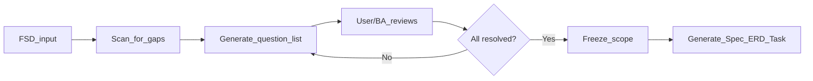

# Discovery Questions & Discussion Mode

Structured template for the **discussion phase** — before generating artifacts. Use when the FSD is still ambiguous, incomplete, or the team is scoping with BA/Product.

---

## When to Use Discussion Mode

| Signal | Action |
|--------|--------|
| FSD has vague requirements ("should be flexible", "TBD") | List as `QUESTION_FOR_BA` |
| Multiple interpretations possible | List all interpretations, ask which is correct |
| Missing edge cases | Propose edge cases, ask confirmation |
| Conflicting requirements between sections | Flag as `CONFLICT` |
| No data model described | Propose entities, ask confirmation |
| Auth/role rules unclear | Propose role matrix, ask confirmation |

**Rule:** Never silently guess. Always list `ASSUMPTION` or `QUESTION_FOR_BA` instead.

---

## Question Categories

### 1. Data & Entities

```markdown
## Data Questions

- What are the main entities in this feature?
- Which entity owns the data (aggregate root)?
- Are there many-to-many relationships? If yes, what's the join table called?
- What is the expected data volume? (rows/day, total rows in 1 year)
- Are there soft-delete requirements? Which entities?
- Are audit trails needed? Which entities need `created_by`, `updated_by`?
- Are there hierarchical/nested entities? (categories, org structures)
- What status/enum values exist? Are they fixed or configurable?
- Is there a need for data archival after X months?
- Are there PII/sensitive fields that need encryption or masking?
```

### 2. Business Flow & Edge Cases

```markdown
## Flow Questions

- What is the happy path? (step by step)
- What happens when {step} fails?
- Are there approval flows? Who approves? What if approver is unavailable?
- Can actions be undone/reversed? Under what conditions?
- What happens when the same action is triggered twice? (idempotency)
- Are there time-based rules? (expiry, deadline, scheduling)
- Are there concurrent access scenarios? (two users editing same record)
- What happens to related data when parent is deleted/deactivated?
- Are there notification requirements at each step?
- What happens outside business hours / maintenance windows?
```

### 3. Auth & Authorization

```markdown
## Auth Questions

- Who are the actors/roles in this feature?
- What actions can each role perform? (provide role matrix)
- Are there ownership rules? (user can only edit their own data)
- Is there multi-tenancy? How is tenant isolation enforced?
- Are there IP/geo-based access restrictions?
- Should actions be logged for audit? Which actions?
- Are there time-limited permissions? (temporary access, delegation)
```

### 4. Integration & Third-Party

```markdown
## Integration Questions

- Does this feature integrate with external systems? Which ones?
- What is the integration pattern? (sync REST, async webhook, message queue)
- What happens when the external system is down? (fallback, retry, queue)
- Are there SLA requirements for external calls? (timeout, retries)
- Is the external system already integrated, or is this new?
- Are there API rate limits on the external system?
- Who owns the external API credentials?
- Is there a sandbox/test environment available?
```

### 5. Non-Functional Requirements (NFR)

```markdown
## NFR Questions

- What is the expected response time? (< 500ms? < 2s?)
- What is the expected concurrent user count?
- What is the expected data growth rate?
- Are there regulatory/compliance requirements? (GDPR, PCI-DSS, local laws)
- Is there a required uptime SLA? (99.9%, 99.99%)
- Are there disaster recovery requirements?
- Is there a need for horizontal scaling? At what threshold?
- Are there logging/monitoring requirements?
- What environments are needed? (dev, staging, uat, prod)
```

### 6. UX / UI Alignment

```markdown
## UX Questions

- Is there a Figma/design reference? If yes, flag as `@figma_link`
- Does the UI show data that isn't in the current spec?
- Are there sorting/filtering/pagination requirements visible in the design?
- Are there loading states, error states, empty states to handle?
- Are there offline/poor-network scenarios to handle on mobile?
- Are there multi-step forms/wizards? What happens on page refresh?
- Does the design imply real-time updates? (WebSocket, SSE, polling?)
```

---

## Output Format

### Question List

```markdown
## Open Questions: {Feature Name}

### QUESTION_FOR_BA

| # | Category | Question | Impact if Unanswered |
|---|----------|----------|---------------------|
| Q1 | Data | What status values exist for orders? | Cannot design ERD status column |
| Q2 | Flow | What happens when payment gateway is down? | Cannot design error handling |
| Q3 | Auth | Can customer service agents view all users? | Cannot define role permissions |

### ASSUMPTION

| # | Assumption | Reason |
|---|-----------|--------|
| A1 | Order status: pending → paid → shipped → completed | Based on similar module in project X |
| A2 | Payment gateway timeout: 30s, retry 3x | Standard retry policy from infra team |

### CONFLICT

| # | Requirement A | Requirement B | Clarification Needed |
|---|---------------|---------------|---------------------|
| C1 | §2.3 "User can update email" | §2.3 "Email change requires request" | Which takes priority? |

### DECISION_NEEDED

| # | Decision | Options | Recommendation |
|---|----------|---------|----------------|
| D1 | Soft delete or hard delete for users? | (a) Soft delete with `deleted_at` (b) Hard delete after 30 days | (a) — safer, auditable |
```

---

## Discovery Phase Checklist

Before moving from **discussion** → **spec generation**:

- [ ] All `QUESTION_FOR_BA` items resolved or have explicit `ASSUMPTION`
- [ ] All `CONFLICT` items resolved
- [ ] All `DECISION_NEEDED` items have a chosen option
- [ ] Data entities identified with relationships
- [ ] Business flows mapped (happy + error paths)
- [ ] Roles and permissions defined
- [ ] Edge cases identified and addressed
- [ ] NFRs documented or explicitly deferred
- [ ] UX alignment checked against Figma (if available)

---

## Interaction Pattern



When user says "we're still discussing" or "list open questions" — stay in discovery mode. Do not generate full specs until explicitly asked.
