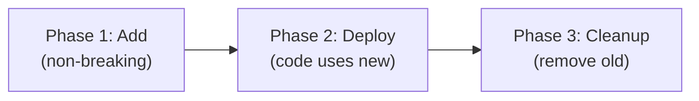

# Migration Strategy & Deployment Plan

Template for database migration planning when gap analysis identifies schema changes. Use alongside `references/gap_analysis.md`.

---

## Migration Severity Classification

| Severity | Description | Risk | Example |
|----------|-------------|------|---------|
| **Safe (Green)** | Additive only, no data loss | Low | Add new table, add nullable column, add index |
| **Moderate (Yellow)** | Column modification, needs transform | Medium | Change column type, rename column, add NOT NULL with default |
| **Dangerous (Red)** | Destructive, potential data loss | High | Drop table, drop column, remove index used in production queries |

**Rule:** Always classify migration severity in the plan. Red migrations require explicit approval.

---

## Migration Plan Template

```markdown
## Migration Plan: {Feature Name}

### Overview

| Field | Detail |
|-------|--------|
| Feature | {name} |
| FSD Reference | {section} |
| Total Changes | {n tables, m columns, k indexes} |
| Severity | Safe / Moderate / Dangerous |
| Estimated Duration | {minutes/hours} |
| Downtime Required | Yes (est. X min) / No (zero-downtime) |
| Rollback Plan | {describe} |

### Database Changes

| # | Table | Change Type | Severity | Detail |
|---|-------|------------|----------|--------|
| 1 | users | ADD COLUMN | Safe | `phone_number VARCHAR(20) NULL` |
| 2 | orders | ADD TABLE | Safe | New table with FK to users |
| 3 | products | ALTER COLUMN | Moderate | `price DECIMAL(12,2)` (was `DECIMAL(10,2)`) |
| 4 | old_sessions | DROP TABLE | Dangerous | Deprecated, confirmed unused |

### Index Changes

| # | Table | Index | Action | Reason |
|---|-------|-------|--------|--------|
| 1 | users | idx_users_email | ADD UNIQUE | FSD requires unique email |
| 2 | orders | idx_orders_created_at | ADD | List endpoint filter/sort |

### Foreign Key Changes

| # | Child Table | FK Column | Parent Table | Parent Column | Action |
|---|-------------|-----------|--------------|---------------|--------|
| 1 | orders | user_id | users | id | ADD |
```

---

## Zero-Downtime Migration Strategy

### Principle

Code must work with **both** old and new schema during deployment transition.

### Phase Approach



#### Phase 1 — Add (non-breaking)

```sql
-- Add new columns as NULLABLE (no breaking change)
ALTER TABLE users ADD COLUMN phone_number VARCHAR(20) NULL;

-- Add new tables
CREATE TABLE orders (...);

-- Add new indexes (CONCURRENTLY for PostgreSQL)
CREATE INDEX CONCURRENTLY idx_users_phone ON users(phone_number);
```

**Deployment:** DB migration first, then code deploy. Old code ignores new columns.

#### Phase 2 — Deploy Code

- Code starts reading/writing new columns
- Code handles both old and new schema (backward compatible)
- Feature flags can gate new functionality

#### Phase 3 — Cleanup (after confirmation)

```sql
-- Make column NOT NULL (after code ensures it's populated)
ALTER TABLE users ALTER COLUMN phone_number SET NOT NULL;

-- Drop deprecated columns (only after Phase 2 is stable for N days)
-- ALTER TABLE users DROP COLUMN old_phone;
```

**Rule:** Phase 3 is a **separate deployment**, at least 1 sprint after Phase 2.

---

## Data Migration

When transforming existing data:

```markdown
### Data Migration Script

| Step | SQL / Action | Rows Affected | Est. Duration |
|------|-------------|---------------|---------------|
| 1 | Backfill `phone_number` from `contact_info->>'phone'` | ~50,000 rows | ~5s |
| 2 | Update status values: `'pending'` → `'awaiting_verification'` | ~10,000 rows | ~2s |
| 3 | Insert into new table from old table with transformation | ~25,000 rows | ~3s |

### Data Migration SQL Template

```sql
-- Step 1: Backfill new column from JSON
UPDATE users
SET phone_number = contact_info->>'phone'
WHERE phone_number IS NULL AND contact_info->>'phone' IS NOT NULL;

-- Step 2: Migrate status values
UPDATE users
SET status = 'awaiting_verification'
WHERE status = 'pending' AND email_verified = false;

-- Step 3: Verify data integrity
SELECT COUNT(*) as total,
       COUNT(phone_number) as with_phone
FROM users;
```
```

---

## Rollback Plan

```markdown
### Rollback Plan

| Step | Action | Risk |
|------|--------|------|
| 1 | Revert code deployment to previous version | Low — code change only |
| 2 | Drop new indexes | Low — instant |
| 3 | Drop new columns (if Phase 1 only) | Low — no data dependency |
| 4 | Restore dropped columns from backup | **High** — requires DB backup restore |
| 5 | Full DB restore from pre-migration backup | **Last resort** — data loss since backup |

### Rollback SQL (prepare upfront)

```sql
-- Rollback for Step 1 (add column)
ALTER TABLE users DROP COLUMN IF EXISTS phone_number;

-- Rollback for Step 2 (add table)
DROP TABLE IF EXISTS orders;

-- Rollback for Step 3 (add index)
DROP INDEX IF EXISTS idx_users_phone;
```

### Rollback Triggers

- Migration fails to complete within estimated time × 2
- Data integrity check fails post-migration
- Application error rate exceeds threshold post-deploy
- Manual decision by tech lead
```

---

## Deployment Sequence

```markdown
### Deployment Sequence

| Order | Action | Owner | Duration | Verification |
|-------|--------|-------|----------|-------------|
| 1 | Create DB backup | DBA / DevOps | ~10 min | Backup file exists |
| 2 | Run Phase 1 migration (add) | BE Dev | ~5 min | Schema matches expected |
| 3 | Verify schema | BE Dev | ~2 min | All new columns/tables exist |
| 4 | Run data migration scripts | BE Dev | ~1 min | Row counts match expected |
| 5 | Deploy BE code (new version) | DevOps | ~5 min | Health check passes |
| 6 | Deploy FE code (if applicable) | DevOps | ~3 min | Smoke test passes |
| 7 | Monitor error rate | All | 30 min | Error rate < baseline |
| 8 | Phase 3 cleanup (next sprint) | BE Dev | ~5 min | Deprecated objects removed |

### Monitoring Post-Deploy

| Metric | Threshold | Action if Exceeded |
|--------|-----------|-------------------|
| Error rate (5xx) | > 1% of requests | Trigger rollback |
| Response time (p95) | > 2× baseline | Investigate, potential rollback |
| DB query time (affected tables) | > 2× baseline | Check new indexes, optimize |
| Failed background jobs | > 0 | Immediate investigation |
```

---

## Migration Checklist

- [ ] All schema changes listed with severity classification
- [ ] Zero-downtime phase approach documented (or explicit downtime approved)
- [ ] Data migration scripts prepared and tested on staging
- [ ] Rollback SQL prepared for each change
- [ ] Rollback triggers defined
- [ ] Deployment sequence documented with owners
- [ ] Post-deploy monitoring metrics defined
- [ ] Phase 3 cleanup scheduled as separate task
- [ ] Stakeholder notified of planned changes
- [ ] Staging environment tested with production-like data
