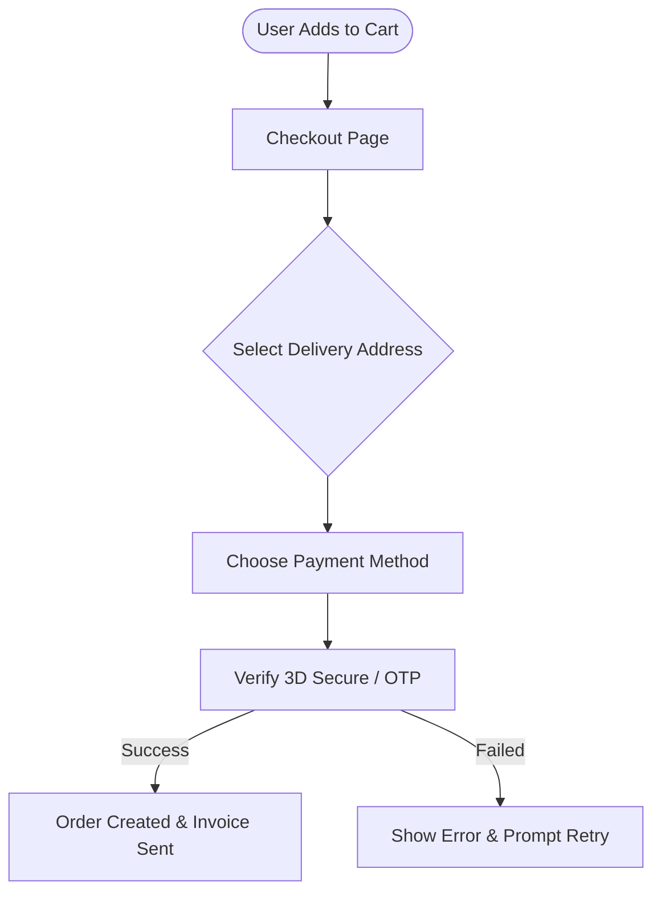
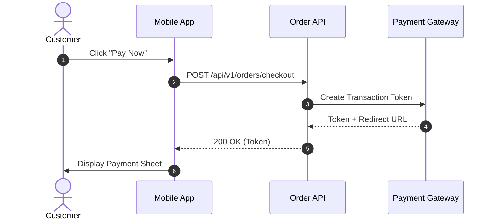

# Visual Sketch & Wireframe Canvas Format

This guide defines how to generate **interactive sketches, visual flows, UI wireframes, and architecture diagrams** for the Onesist **Canvas** (`/projects/:id/canvas`).

---

## 1. File Location & Naming Conventions

All sketches must be written to:
```
output/sketches/<feature_or_flow>.<ext>
```

Supported extensions:
1. **`.excalidraw.json`** or **`.excalidraw`** *(Recommended for full UI Wireframes & Layouts)*: Excalidraw JSON document.
2. **`.mmd`** *(Recommended for Quick Flows / Sequence / Architecture)*: Clean Mermaid diagram code that auto-converts to editable Excalidraw elements.

### Examples:
- `output/sketches/auth_login_wireframe.excalidraw.json`
- `output/sketches/order_processing_flow.mmd`
- `output/sketches/system_topology.mmd`
- `output/sketches/checkout_step_wireframe.excalidraw.json`

---

## 2. Format A: Excalidraw JSON (`.excalidraw.json`)

An Excalidraw JSON file must adhere to the standard schema:

```json
{
  "type": "excalidraw",
  "version": 2,
  "source": "https://onesist.internal",
  "elements": [
    {
      "id": "box_1",
      "type": "rectangle",
      "x": 100,
      "y": 100,
      "width": 320,
      "height": 480,
      "angle": 0,
      "strokeColor": "#1e1e1e",
      "backgroundColor": "#ffffff",
      "fillStyle": "solid",
      "strokeWidth": 2,
      "strokeStyle": "solid",
      "roughness": 1,
      "opacity": 100,
      "groupIds": [],
      "roundness": { "type": 3 },
      "seed": 12345,
      "version": 1,
      "versionNonce": 1,
      "isDeleted": false
    },
    {
      "id": "text_1",
      "type": "text",
      "x": 120,
      "y": 120,
      "width": 200,
      "height": 25,
      "angle": 0,
      "strokeColor": "#111827",
      "backgroundColor": "transparent",
      "fillStyle": "solid",
      "strokeWidth": 1,
      "strokeStyle": "solid",
      "roughness": 0,
      "opacity": 100,
      "groupIds": [],
      "roundness": null,
      "seed": 12346,
      "version": 1,
      "versionNonce": 1,
      "isDeleted": false,
      "text": "User Login Screen",
      "fontSize": 18,
      "fontFamily": 1,
      "textAlign": "left",
      "verticalAlign": "top"
    }
  ],
  "appState": {
    "viewBackgroundColor": "#121212",
    "currentItemFontFamily": 1
  },
  "files": {}
}
```

### Key UI Wireframing Element Styles:
- **Card / Screen Frame**: `type: "rectangle"`, `backgroundColor: "#ffffff"` (or `#1e1e1e`), `roundness: { "type": 3 }`.
- **Form Input**: `type: "rectangle"`, `height: 38`, `backgroundColor: "#f9fafb"`, `strokeColor: "#d1d5db"`.
- **Primary Button**: `type: "rectangle"`, `height: 40`, `backgroundColor: "#2563eb"`, `strokeColor: "#1d4ed8"`, with centered white text.
- **Sticky Note / SA Annotation**: `type: "rectangle"`, `backgroundColor: "#fef08a"` (yellow), `strokeColor: "#eab308"`.

---

## 3. Format B: Mermaid Flowchart / Sequence (`.mmd`)

If generating a visual flow or sequence diagram, write a `.mmd` file containing standard Mermaid syntax. The Onesist Canvas can import it directly with 1 click:

### Flowchart Example (`output/sketches/order_flow.mmd`):


### Sequence Diagram Example (`output/sketches/payment_sequence.mmd`):


---

## 4. Best Practices for System Analysts

1. **Keep Dimensions Proportional**:
   - Mobile screen: ~320px width × 640px height.
   - Web desktop screen: ~720px–1000px width × 500px–700px height.
   - Form inputs: ~36px–42px height.
2. **Use Annotations (Sticky Notes)**:
   - Always accompany complex wireframes with 1 or 2 sticky notes explaining business rules, validation rules, or edge cases.
3. **Cross-Linking**:
   - When generating `spec_api.md` or `task.md`, reference the corresponding sketch:
     `> [!NOTE] Refer to UI wireframe at output/sketches/checkout_wireframe.excalidraw.json`
