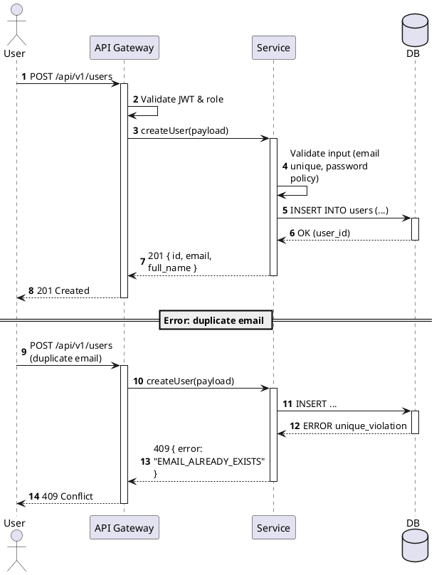
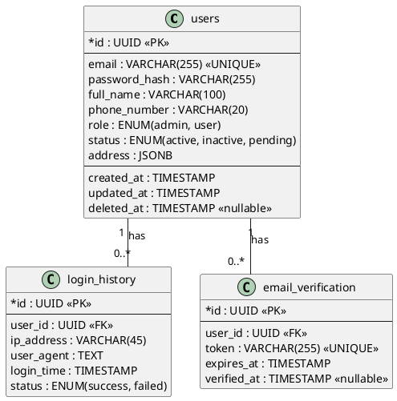
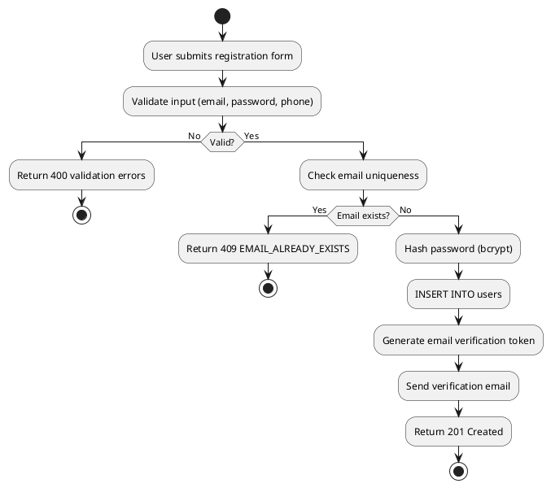
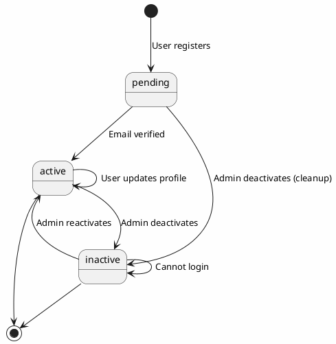
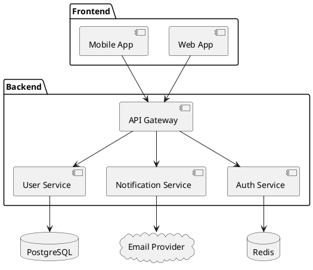
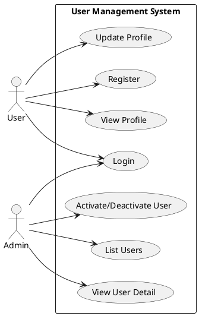

# UML Diagram Output Format (PlantUML)

Generate **PlantUML** diagrams from FSD so users can paste them into [PlantUML](https://plantuml.com/plantuml), [PlantText](https://www.planttext.com/), or any PlantUML-compatible renderer.

All UML output goes inside a **` ```plantuml `** fenced code block for easy copy-paste.

## Diagram Types

### 1. Sequence Diagram (API / Interaction Flow)

Use for: endpoint flow, service-to-service interaction, user journey.



### 2. Class Diagram (Entity / Data Model)

Use for: entity relationships, alternative visual for ERD.



### 3. Activity Diagram (Business Flow / Workflow)

Use for: multi-step business process, approval flow, state-dependent logic.



### 4. State Diagram (Entity Lifecycle)

Use for: status transitions, entity lifecycle (e.g. order status, user status).



### 5. Component Diagram (System Architecture)

Use for: high-level system integration, microservices overview.



### 6. Use Case Diagram

Use for: actor vs system capability mapping from FSD requirements.



## When to generate which diagram

| FSD Content | Diagram | Priority |
|-------------|---------|----------|
| Endpoint flow, API interaction | Sequence | **Always** (per endpoint group) |
| Data entities, relationships | Class | **Always** (alongside ERD/DBML) |
| Multi-step business process | Activity | When FSD has workflow/approval |
| Status transitions | State | When entity has lifecycle |
| System integrations | Component | When FSD mentions external systems |
| Actor capabilities | Use Case | When scoping with BA |

## Output rules

1. Each diagram type in its own **` ```plantuml `** fenced block.
2. Use `@startuml` / `@enduml` wrappers (required by PlantUML renderer).
3. Name relationships and transitions with **business meaning** (not just column names).
4. Include **error/alternative paths** in sequence and activity diagrams when FSD specifies them.
5. Match **entity/field names** exactly with ERD (consistency).
6. Match **endpoint paths** exactly with spec_api (consistency).
7. For large systems, split into **multiple diagrams** per module/feature rather than one giant diagram.

## File naming

| Diagram | Typical filename |
|---------|------------------|
| Sequence | `uml_sequence_<feature>.md` or inline in `spec_api.md` |
| Class | `uml_class_<feature>.md` or inline in `erd.md` |
| Activity | `uml_activity_<feature>.md` |
| State | `uml_state_<entity>.md` |
| Component | `uml_component_<system>.md` |
| Use Case | `uml_usecase_<module>.md` |

## Quality checklist

- [ ] Every endpoint group has a sequence diagram or is explicitly grouped
- [ ] Entity names and field names match ERD exactly
- [ ] Endpoint paths match spec_api exactly
- [ ] Error paths documented in sequence/activity when FSD specifies them
- [ ] Status values in state diagram match ERD enum/status column
- [ ] Diagrams are split per feature/module (not one giant diagram)
- [ ] Each diagram is in a ` ```plantuml ` fence with `@startuml` / `@enduml`
